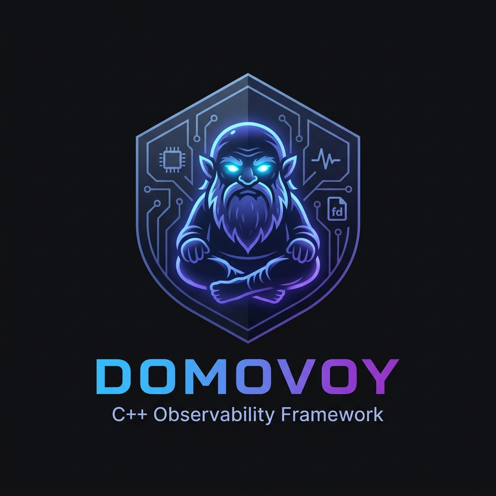

<p align="center">
  
</p>

# Domovoy

> A cross-platform, lightweight C++20 framework for **production observability** — gathering memory leaks, heap corruption, CPU hotspots, IO leaks, and crash context with minimal overhead.

Domovoy is designed to be embedded in shipped software so that you can gather high-quality diagnostics from production crashes and slow sessions, in a way that is **safe, isolated from application heap corruption, and fully opt-in**.

> **Name & mythology:** In Slavic folklore the *Domovoy* (домово́й) is the protective spirit of the household — a small, ancient, bearded guardian who silently watches over the home, keeping track of everything that happens within it, and warning of impending disaster. Domovoy the framework plays the same role for your process: it watches silently in the background, keeps track of every allocation, file descriptor, thread, and signal, and surfaces problems the moment they occur.

---

## Table of Contents

- [Overview](#overview)
- [Features](#features)
- [Architecture](#architecture)
- [Requirements](#requirements)
- [Quick Start](#quick-start)
- [Build System](#build-system)
  - [`scripts/build.sh` / `scripts/build.bat`](#scriptsbuildsh-and-scriptsbuildbat)
  - [Sanitizer CMake Options](#sanitizer-cmake-options)
- [Test Scripts](#test-scripts)
  - [`scripts/test_unit.sh` / `scripts/test_unit.bat`](#scriptstest_unitsh--scriptstest_unitbat--unit-tests)
  - [`scripts/test_integration.sh` / `scripts/test_integration.bat`](#scriptstest_integrationsh--scriptstest_integrationbat--integration-tests)
  - [`scripts/test_bench.sh` / `scripts/test_bench.bat`](#scriptstest_benchsh--scriptstest_benchbat--benchmarks)
  - [`scripts/test_all.sh` / `scripts/test_all.bat`](#scriptstest_allsh--scriptstest_allbat--full-suite-orchestrator)
- [Docker / Containerized Testing](#docker--containerized-testing)
  - [Prerequisites](#prerequisites)
  - [`scripts/docker_build.sh`](#scriptsdocker_buildsh--build-images)
  - [`scripts/docker_test.sh`](#scriptsdocker_testsh--run-tests-in-a-container)
  - [`docker/docker-compose.yml`](#dockerdocker-composeyml--parallel-multi-environment-testing)
- [Usage in Your Application](#usage-in-your-application)
  - [Initialization](#initialization)
  - [Configuration Reference](#configuration-reference)
  - [Custom Reporters](#custom-reporters)
- [Output Format](#output-format)
  - [Memory Leak Report](#memory-leak-report)
  - [CPU Hotspot Report](#cpu-hotspot-report)
  - [IO Leak Report](#io-leak-report)
  - [Crash Report](#crash-report)
- [Platform Support](#platform-support)
  - [macOS](#macos)
  - [Linux](#linux)
  - [Windows](#windows)
- [Performance Characteristics](#performance-characteristics)
- [Subsystem Deep-Dives](#subsystem-deep-dives)
  - [IsolatedAllocator](#isolatedallocator)
  - [MemoryAnalyzer](#memoryanalyzer)
  - [CpuMonitor](#cpumonitor)
  - [IoMonitor](#iomonitor)
  - [CrashHandler](#crashhandler)
- [Project Structure](#project-structure)
- [Contributing](#contributing)
- [License](#license)

---

## Overview

Modern C++ applications deployed to end-users suffer from subtle resource problems that are nearly impossible to reproduce in development:

- **Memory leaks** that accumulate over hours of uptime
- **Heap corruption** that silently corrupts unrelated allocations
- **CPU regressions** visible only on real-world workloads
- **IO leaks** — file descriptors and sockets not closed on error paths
- **Silent crashes** — processes that die with no useful crash log

Domovoy hooks into the process lifecycle at `Init()` and `Shutdown()`, passively gathers telemetry, and writes a structured **JSON report** to a location of your choosing. It operates on a **separate OS-mapped memory region** so its own allocations are immune to heap corruption in your application.

---

## Features

| Feature | macOS | Linux | Windows |
|---|---|---|---|
| **Isolated Allocator** (OS-mapped memory) | ✅ | ✅ | ✅ |
| **Memory Leak Detection** (heap walk / malloc hooks) | ✅ | ✅ | ✅ |
| **CPU Hotspot Profiling** (passive thread) | ✅ | ✅ | ✅ |
| **IO Leak Detection** (`open`/`socket`/`close`) | ✅ `DYLD_INTERPOSE` | ✅ `dlsym` | ✅ Detours |
| **Crash Context** (backtrace on fatal signal) | ✅ `sigaction` | ✅ `sigaction` | ✅ VEH |
| **JSON Reporting** | ✅ | ✅ | ✅ |
| **Custom Reporter Interface** | ✅ | ✅ | ✅ |

---

## Architecture

```
┌──────────────────────────────────────────────────────────┐
│                    Your Application                       │
│                                                          │
│   DomovoyCore::Init(config)  ←  explicit, user-driven   │
│   DomovoyCore::Shutdown()    ←  explicit, user-driven   │
└────────────────────┬─────────────────────────────────────┘
                     │
          ┌──────────▼──────────┐
          │     DomovoyCore     │  Singleton lifecycle
          └──────────┬──────────┘
                     │
        ┌────────────┼─────────────────┐──────────────┐
        ▼            ▼                 ▼              ▼
  ┌───────────┐ ┌──────────┐ ┌──────────────┐ ┌──────────────┐
  │MemoryAnal-│ │CpuMonitor│ │  IoMonitor   │ │CrashHandler  │
  │yzer       │ │(bg thread)│ │(interposition│ │(alt-stack /  │
  │(heap walk)│ │           │ │ hooks)       │ │ VEH)         │
  └─────┬─────┘ └─────┬────┘ └──────┬───────┘ └──────┬───────┘
        │             │             │                 │
        └─────────────┴─────────────┴─────────────────┘
                                   │
                          ┌────────▼────────┐
                          │   Reporter       │  Interface
                          │  (JsonFileRep.)  │
                          └────────┬────────┘
                                   │
                          ┌────────▼────────┐
                          │  IsolatedAlloc. │  mmap / VirtualAlloc
                          │  (OS memory)    │  never touches app heap
                          └─────────────────┘
```

All internal data structures — strings, maps, JSON nodes — allocate through `IsolatedAllocator`, which uses raw OS pages separate from the application's heap. This ensures Domovoy remains functional even when the application's heap is corrupted.

---

## Requirements

| Dependency | Version | Notes |
|---|---|---|
| **CMake** | ≥ 3.20 | |
| **C++ compiler** | C++20 | GCC 11+, Clang 14+, AppleClang 14+, MSVC 19.30+ |
| **Git** | any | For `FetchContent` dependency fetching |
| **Python 3** | any | Required by some CMake detection scripts |
| **Docker** *(optional)* | 20.10+ | For containerized cross-platform testing |

All other dependencies (GoogleTest, Google Benchmark, nlohmann/json, cpptrace, libdwarf, Microsoft Detours on Windows) are automatically fetched by CMake `FetchContent` at configure time.

---

## Quick Start

```bash
# Clone
git clone https://github.com/yourorg/domovoy.git
cd domovoy

# Build (Debug)
./scripts/build.sh           # macOS/Linux
scripts\build.bat            # Windows

# Run all tests
./scripts/test_all.sh        # macOS/Linux
scripts\test_all.bat         # Windows

# Run benchmarks
./scripts/test_bench.sh      # macOS/Linux
scripts\test_bench.bat       # Windows
```

---

## Build System

Domovoy uses CMake as its build system. Convenience wrapper scripts [`scripts/build.sh`](scripts/build.sh) (and [`scripts/build.bat`](scripts/build.bat) for Windows) handle all CMake configuration and build invocation.

### `scripts/build.sh` and `scripts/build.bat`

```
Usage: ./scripts/build.sh [OPTIONS]
       scripts\build.bat [OPTIONS]

  --type <Debug|Release|RelWithDebInfo>   Build type (default: Debug)
  --asan                                  Enable AddressSanitizer
  --tsan                                  Enable ThreadSanitizer
  --ubsan                                 Enable UndefinedBehaviorSanitizer
  --msan                                  Enable MemorySanitizer (Clang only)
  --clean                                 Delete build directory first
  --jobs <N>                              Parallel jobs (default: nproc)
```

```bash
# Default Debug build
./scripts/build.sh

# Release build
./scripts/build.sh --type Release

# RelWithDebInfo — optimised + debug symbols, best for profiling
./scripts/build.sh --type RelWithDebInfo

# Start fresh
./scripts/build.sh --clean

# Limit parallel jobs
./scripts/build.sh --jobs 8

# ASan + UBSan in one go
./scripts/build.sh --asan --ubsan

# TSan (cannot be combined with ASan)
./scripts/build.sh --tsan
```

The script respects the `DOMOVOY_BUILD_DIR` environment variable to override where the build tree is written. This is used automatically by `docker_test.sh` to avoid polluting the host build directory:

```bash
DOMOVOY_BUILD_DIR=/tmp/domovoy-build ./scripts/build.sh
```

Alternatively, invoke CMake directly:

```bash
cmake -B build \
    -DCMAKE_BUILD_TYPE=Release \
    -DCMAKE_CXX_COMPILER=clang++ \
    -DENABLE_ASAN=ON

cmake --build build --parallel 8
```

### Sanitizer CMake Options

Domovoy's `cmake/Sanitizers.cmake` exposes these options directly if you prefer raw CMake:

| CMake Flag | Equivalent script flag | Description |
|---|---|---|
| `-DENABLE_ASAN=ON` | `--asan` | AddressSanitizer — buffer overflows, use-after-free |
| `-DENABLE_TSAN=ON` | `--tsan` | ThreadSanitizer — data races |
| `-DENABLE_UBSAN=ON` | `--ubsan` | UndefinedBehaviorSanitizer — signed overflow, null deref |
| `-DENABLE_MSAN=ON` | `--msan` | MemorySanitizer — uninitialized reads (Clang only) |

> **Note:** TSan and ASan are mutually exclusive. MSan requires a fully Clang-instrumented stdlib.

---

## Test Scripts

All test scripts live under `scripts/` and are self-contained. They are available as `.sh` scripts for POSIX systems and `.bat` scripts for Windows. Each script will automatically invoke `build.sh` or `build.bat` (building the project if the build directory does not exist yet), then invoke CTest with the appropriate label filter.

> **CTest labels**: every test target carries a CTest label (`unit` or `integration`) so that each script selects only its own tests. The scripts use `--no-tests=error` so a misconfigured build that produces 0 matching tests is treated as a failure rather than a silent pass.

### `scripts/test_unit.sh` / `scripts/test_unit.bat` — Unit Tests

Unit tests target isolated components (currently the `IsolatedAllocator`).

```
Usage: ./scripts/test_unit.sh [OPTIONS]
       scripts\test_unit.bat [OPTIONS]

  --build-type <type>    Forwarded to build script (default: Debug)
  --asan                 Enable AddressSanitizer
  --tsan                 Enable ThreadSanitizer
  --ubsan                Enable UndefinedBehaviorSanitizer
  --filter <pattern>     GTest filter (e.g. "AllocatorTest.SingleAllocation")
  --verbose              Verbose CTest output
```

```bash
# Basic run
./scripts/test_unit.sh

# With AddressSanitizer
./scripts/test_unit.sh --asan

# Filter to a specific test case
./scripts/test_unit.sh --filter "AllocatorTest.MultipleAllocations"

# Verbose (prints each test's stdout even on success)
./scripts/test_unit.sh --verbose
```

### `scripts/test_integration.sh` / `scripts/test_integration.bat` — Integration Tests

Integration tests exercise the full framework lifecycle. Each scenario (`leak`, `cpu`, `io`, `crash`) starts and shuts down a real `DomovoyCore` instance.

```
Usage: ./scripts/test_integration.sh [OPTIONS]
       scripts\test_integration.bat [OPTIONS]

  --build-type <type>    Forwarded to build script (default: Debug)
  --asan / --tsan / --ubsan
  --test <name>          Run one suite: leak | cpu | io | crash | all
  --verbose
```

```bash
# Run all integration tests
./scripts/test_integration.sh

# Run a single scenario
./scripts/test_integration.sh --test leak
./scripts/test_integration.sh --test cpu
./scripts/test_integration.sh --test io
./scripts/test_integration.sh --test crash

# Run with AddressSanitizer + UBSan
./scripts/test_integration.sh --asan --ubsan
```

### `scripts/test_bench.sh` / `scripts/test_bench.bat` — Benchmarks

Benchmarks are **always built in Release mode** regardless of the host build directory's current type, because Debug timings are not meaningful.

```
Usage: ./scripts/test_bench.sh [OPTIONS]
       scripts\test_bench.bat [OPTIONS]

  --filter <regex>         Google Benchmark name filter
  --format <json|console>  Output format (default: console)
  --out <file>             Write results to file (combine with --format json)
  --min-time <seconds>     Minimum time per benchmark (default: 1.0)
```

```bash
# Run all benchmarks (console output)
./scripts/test_bench.sh

# Only run allocator benchmarks
./scripts/test_bench.sh --filter "BM_IsolatedAllocator"

# Save results as JSON for CI artifact storage
./scripts/test_bench.sh --format json --out bench_results.json

# Use longer measurement time for more stable numbers
./scripts/test_bench.sh --min-time 3.0
```

### `scripts/test_all.sh` / `scripts/test_all.bat` — Full Suite Orchestrator

Runs unit, integration, and benchmarks in sequence and prints a pass/fail summary.

```
Usage: ./scripts/test_all.sh [OPTIONS]
       scripts\test_all.bat [OPTIONS]

  --asan / --tsan / --ubsan   Applied to unit + integration (not benchmarks)
  --skip-bench                Skip the benchmark step
  --verbose
```

```bash
# Run everything
./scripts/test_all.sh

# Sanitizers on, benchmarks skipped (fast CI mode)
./scripts/test_all.sh --asan --ubsan --skip-bench

# Full run with verbose output
./scripts/test_all.sh --verbose
```

Example output:
```
============================================================
  SUMMARY
============================================================
  ✅  Unit Tests
  ✅  Integration Tests
  ✅  Benchmarks

  Passed: 3   Failed: 0
============================================================
```

---

## Docker / Containerized Testing

Docker support lets you run Domovoy's full test suite on Linux from any host — including macOS (via [Colima](https://github.com/abiosoft/colima) or Docker Desktop). All scripts use bind-mounts so the container always sees your latest source, and build artefacts stay in the container at `DOMOVOY_BUILD_DIR=/tmp/domovoy-build` (never polluting your host `build/` directory).

### Prerequisites

```bash
# macOS — start a lightweight Linux VM
brew install colima docker
colima start

# Or use Docker Desktop (https://www.docker.com/products/docker-desktop)
```

### Available Images

| Image | Dockerfile | Base | Compiler | Purpose |
|---|---|---|---|---|
| `domovoy:ubuntu` | `docker/Dockerfile.ubuntu` | Ubuntu 22.04 | GCC 11 | Standard Linux build and all tests |
| `domovoy:clang` | `docker/Dockerfile.clang` | Ubuntu 22.04 | Clang 17 | Sanitizer-focused (ASan / UBSan) runs |

### `scripts/docker_build.sh` — Build Images

```
Usage: ./scripts/docker_build.sh [OPTIONS]

  --image <ubuntu|clang|all>   Which image to build (default: all)
  --tag <prefix>               Tag prefix (default: domovoy)
  --no-cache                   Pass --no-cache to docker build
```

```bash
# Build both images
./scripts/docker_build.sh

# Build only the Ubuntu image
./scripts/docker_build.sh --image ubuntu

# Build only the Clang image
./scripts/docker_build.sh --image clang

# Force a fresh build (no layer cache)
./scripts/docker_build.sh --no-cache
```

### `scripts/docker_test.sh` — Run Tests in a Container

```
Usage: ./scripts/docker_test.sh [OPTIONS]

  --image <ubuntu|clang|all>              Image to use (default: all)
  --suite <unit|integration|bench|all>   Test suite (default: all)
  --asan / --tsan / --ubsan              Sanitizer flags passed into the container
  --rebuild                              Re-build the image before running
  --interactive                          Open a bash shell instead of running tests
```

> **Auto-build:** if the requested image does not exist locally, `docker_test.sh` automatically builds it before running. You never need to call `docker_build.sh` separately unless you want explicit control.

```bash
# First run — image is built automatically, then unit tests run
./scripts/docker_test.sh --image ubuntu --suite unit

# Run all integration tests in the Ubuntu container
./scripts/docker_test.sh --image ubuntu --suite integration

# Run with AddressSanitizer + UBSan inside the Clang container
./scripts/docker_test.sh --image clang --suite integration --asan --ubsan

# Run benchmarks (Release build inside the container)
./scripts/docker_test.sh --image ubuntu --suite bench

# Run the full suite across both images (builds + tests both)
./scripts/docker_test.sh --image all --suite all

# Force re-build the image (e.g. after changing a Dockerfile)
./scripts/docker_test.sh --image ubuntu --suite unit --rebuild

# Drop into an interactive bash shell for debugging
./scripts/docker_test.sh --image ubuntu --interactive
# Or in the Clang container:
./scripts/docker_test.sh --image clang --interactive
```

> **Security note:** `--cap-add SYS_PTRACE` and `--security-opt seccomp=unconfined` are passed automatically by `docker_test.sh`. These are required for `sigaltstack` (crash handler) and sanitizer symbolisation to work inside the container.

### `docker/docker-compose.yml` — Parallel Multi-Environment Testing

The Compose file runs the Ubuntu and Clang environments in parallel and has a separate `bench` profile for benchmark-only runs.

```bash
# Run Ubuntu + Clang tests in parallel (default services)
docker compose -f docker/docker-compose.yml up

# Build images first if needed
docker compose -f docker/docker-compose.yml build

# Run only the Ubuntu service
docker compose -f docker/docker-compose.yml run ubuntu-tests

# Run only the Clang sanitizer service
docker compose -f docker/docker-compose.yml run clang-sanitizers

# Run benchmarks (opt-in via the 'bench' profile)
docker compose -f docker/docker-compose.yml --profile bench up benchmarks

# Follow logs across all services
docker compose -f docker/docker-compose.yml up --abort-on-container-exit
```

#### Build directory isolation

All container runs set `DOMOVOY_BUILD_DIR=/tmp/domovoy-build` (inside the container filesystem). This means:
- The host's `build/` directory (compiled for macOS/the host OS) is **never touched** by the container.
- The container's build tree is **ephemeral** — each `docker run` starts with a clean CMake configure step.
- There is no CMake cache path mismatch between host and container builds.

---

## Usage in Your Application

### Installation

Add Domovoy as a submodule or `FetchContent` dependency:

```cmake
include(FetchContent)
FetchContent_Declare(
    domovoy
    GIT_REPOSITORY https://github.com/yourorg/domovoy.git
    GIT_TAG        v1.0.0
)
FetchContent_MakeAvailable(domovoy)

target_link_libraries(your_app PRIVATE domovoy)
```

### Initialization

```cpp
#include <domovoy/core.h>

int main(int argc, char** argv) {
    // Configure Domovoy before your application starts
    domovoy::DomovoyConfig config;

    // Directory where JSON reports will be written
    config.output_dir = "/var/log/myapp/telemetry";

    // Feature flags
    config.enable_leak_detection          = true;
    config.enable_cpu_profiler            = true;
    config.enable_io_monitoring           = true;
    config.enable_crash_handler           = true;

    // Memory for Domovoy's own internal allocator (8 MB default)
    config.allocator_capacity_bytes = 8 * 1024 * 1024;

    domovoy::DomovoyCore::Init(config);

    // ── Run your application ──────────────────────────────────────
    int result = run_app(argc, argv);
    // ─────────────────────────────────────────────────────────────

    // Flush reports and tear down Domovoy
    domovoy::DomovoyCore::Shutdown();
    return result;
}
```

### Configuration Reference

```cpp
struct DomovoyConfig {
    // Output directory for JSON reports (must be writable)
    const char* output_dir = ".";

    // Enable leak detection (heap walk on Win/macOS, malloc hooks on Linux)
    bool enable_leak_detection = true;

    // Enable passive background CPU profiling thread
    bool enable_cpu_profiler = true;

    // Enable IO (FD / socket) leak monitoring
    bool enable_io_monitoring = true;

    // Enable signal/VEH crash handler
    bool enable_crash_handler = true;

    // Size of Domovoy's private OS-mapped memory pool
    size_t allocator_capacity_bytes = 8 * 1024 * 1024; // 8 MB
};
```

### Custom Reporters

Implement the `Reporter` interface to send data to your own telemetry backend (e.g., a cloud metrics service):

```cpp
#include <domovoy/reporter.h>

class MyCloudReporter : public domovoy::Reporter {
public:
    void ReportLeaks(const domovoy::isolated_json<>& report) override {
        send_to_cloud("leaks", report.dump());
    }
    void ReportCpuHotspots(const domovoy::isolated_json<>& report) override {
        send_to_cloud("cpu", report.dump());
    }
    void ReportIoLeak(const domovoy::isolated_json<>& report) override {
        send_to_cloud("io_leaks", report.dump());
    }
    void ReportCrash(const domovoy::isolated_json<>& report) override {
        send_to_cloud("crash", report.dump());
    }
};
```

> **Note:** Custom reporter memory must be managed externally or allocated through `IsolatedAllocator` to maintain heap-corruption resilience.

---

## Output Format

All reports are written as JSON files to `config.output_dir`. Filenames include a subsystem prefix and a timestamp:

```
domovoy_leaks_1693600000000.json
domovoy_cpu_1693600000000.json
domovoy_io_leaks_1693600000000.json
domovoy_crash_1693600000000.json
```

### Memory Leak Report

```json
{
  "type": "memory_leaks",
  "summary": {
    "total_leaks": 2,
    "total_leaked_bytes": 5120,
    "by_size": [
      {
        "size": 4096,
        "count": 1,
        "sample_addresses": ["0x140234562048"]
      },
      {
        "size": 1024,
        "count": 1,
        "sample_addresses": ["0x140234561024"]
      }
    ]
  },
  "leaks_by_size": [
    {
      "size": 4096,
      "addresses": [
        { "address": "0x140234562048", "type": "MyLeakyClass" }
      ]
    },
    {
      "size": 1024,
      "addresses": [
        { "address": "0x140234561024" }
      ]
    }
  ]
}
```

> The `type` field contains the demangled C++ class name if a valid Virtual Method Table (vtable) was found at the beginning of the leaked allocation. Future versions will include allocation stack traces.

### CPU Hotspot Report

```json
{
  "cpu_hotspots": [
    {
      "thread_id": 12345,
      "cpu_time_ns": 15000000,
      "backtrace": [
        { "symbol": "ComputeMatrix()", "filename": "matrix.cpp", "line": 87 },
        { "symbol": "WorkerThread::Run()", "filename": "worker.cpp", "line": 42 }
      ]
    }
  ]
}
```

### IO Leak Report

```json
{
  "io_leaks": [
    { "fd": 4,  "path": "/etc/config.txt", "is_socket": false },
    { "fd": 7,  "path": "socket",           "is_socket": true  }
  ]
}
```

### Crash Report

```json
{
  "type": "crash",
  "signal": 11,
  "backtrace": [
    { "symbol": "CauseCrash()", "filename": "test_crash.cpp", "line": 12 },
    { "symbol": "main",         "filename": "test_crash.cpp", "line": 25 }
  ]
}
```

`signal` is the POSIX signal number (e.g. 11 = `SIGSEGV`) on POSIX, or the Windows exception code on Windows (e.g. `0xC0000005` = `EXCEPTION_ACCESS_VIOLATION`).

---

## Platform Support

### macOS

- **IO interposition**: Uses Apple's `DYLD_INTERPOSE` macro to replace `open(2)`, `close(2)`, and `socket(2)` without requiring `LD_PRELOAD` or dynamic library injection.
- **Heap walk**: Uses `malloc_get_all_zones()` / `vm_range_recorder` from `<malloc/malloc.h>` to enumerate heap zones.
- **Crash handling**: `sigaltstack` + `sigaction` with `SA_ONSTACK | SA_SIGINFO` for `SIGSEGV`, `SIGABRT`, `SIGILL`, `SIGFPE`, `SIGBUS`.
- **Stack traces**: `cpptrace` with `execinfo.h` unwinding and `libdwarf` for DWARF symbol resolution.

### Linux

- **IO interposition**: Uses `dlsym(RTLD_NEXT)` to hook `open`, `open64`, `openat`, `openat64`, `close`, and `socket`.
- **Memory Tracking**: Since Linux `malloc` does not expose a public enumeration API, Domovoy overrides `malloc`, `calloc`, `realloc`, `memalign`, and `posix_memalign` to track allocations in real-time.
- **Crash handling**: Identical `sigaltstack` + `sigaction` path as macOS.
- **Stack traces**: `cpptrace` with `libunwind` or `execinfo` and DWARF symbols.

### Windows

- **IO interposition**: Microsoft Detours library hooks `CreateFileA`, `CreateFileW`, and `CloseHandle`.
- **Heap walk**: Uses the `HeapWalk()` Win32 API for full heap enumeration.
- **Crash handling**: `SetUnhandledExceptionFilter` catches `EXCEPTION_ACCESS_VIOLATION`, `EXCEPTION_ILLEGAL_INSTRUCTION`, `EXCEPTION_INT_DIVIDE_BY_ZERO`, and `EXCEPTION_STACK_OVERFLOW`.
- **Stack traces**: `cpptrace` with `DbgHelp` for symbol resolution.

---

## Performance Characteristics

Results measured on Apple M1 (10-core), Debug build. Release numbers are typically 3–5× better:

```
--------------------------------------------------------------------
Benchmark                          Time             CPU   Iterations
--------------------------------------------------------------------
BM_IsolatedAllocator/64          583 ns          582 ns      5,199,320
BM_IsolatedAllocator/512         964 ns          963 ns      1,000,000
BM_IsolatedAllocator/4096      18314 ns        18236 ns        854,732
BM_CpuProfilerOverhead/1     1264352 ns        13541 ns         10,000
BM_CpuProfilerOverhead/4     1265662 ns        13472 ns         10,000
BM_CpuProfilerOverhead/8     1266445 ns        13571 ns         10,000
```

Key observations:

- **Isolated Allocator**: A 64-byte allocation costs ~580 ns (it's a bump allocator; no per-allocation syscall after initial `mmap`). A 4 KB allocation triggers a new OS block, hence the higher latency.
- **CPU Profiler**: Monitoring 1–8 threads concurrently costs only **~13 µs of CPU time** per wakeup interval — negligible compared to the 1 ms check interval.
- **IO hooks**: `open(2)` interposition adds a single mutex lock + `strlcpy`. On a lightly loaded system this is < 1 µs.

---

## Subsystem Deep-Dives

### IsolatedAllocator

`include/domovoy/allocator.h` | `src/allocator.cpp`

A bump allocator backed by contiguous OS pages (`mmap` on POSIX, `VirtualAlloc` on Windows). Memory is never returned to the OS until `Shutdown()`. This approach:

1. **Eliminates internal fragmentation** for the framework's fixed-size working set.
2. **Survives application heap corruption** — the allocator's metadata is in separate pages not addressable by normal `malloc`/`free`.
3. **Is thread-safe** via a single `std::mutex` protecting the bump pointer.

An STL-compatible adapter, `StlAllocator<T>`, routes all internal `std::unordered_map`, `std::string`, and JSON node allocations through the isolated pool.

### MemoryAnalyzer

`include/domovoy/memory.h` | `src/memory/memory_analyzer.cpp`

Implements a Boehm-Demers-Weiser-inspired reachability analysis:

1. **Enumerate all heap blocks** using platform-native APIs (`malloc_zone` on macOS, `HeapWalk` on Windows) or via real-time interception (`dlsym` hooks for `malloc` family on Linux).
2. **Scan all root regions** — stack, BSS, data segment — for pointer-sized values.
3. Any heap block whose address does not appear anywhere in the root scan is reported as a **potential leak**.
4. **Extract exact C++ types** for leaked objects containing a virtual method table (vtable). This is done safely without triggering access violations:
   - **MSVC (Windows):** Safely parses the `RTTICompleteObjectLocator` metadata using SEH (`__try` / `__except`).
   - **MinGW/GCC (Windows):** Parses the Itanium `type_info` layout using defensive `IsBadReadPtr` checks to avoid virtual dispatch crashes on corrupted memory.
   - **macOS / Linux (POSIX):** Falls back to `cpptrace` leveraging DWARF symbols and `dladdr`.

Limitations: conservative (no type information for non-polymorphic types), false positives possible for blocks reachable only through encoded/compressed pointers.

### CpuMonitor

`include/domovoy/profiler.h` | `src/profiler/cpu_monitor.cpp`

A background `std::thread` wakes up every 100 ms and:

1. Enumerates all threads in the current process (platform API).
2. Reads each thread's accumulated CPU time.
3. If any thread consumed > 90% CPU in the last interval, captures a backtrace with `cpptrace`.
4. Stores the (thread-id → backtrace) map in `IsolatedAllocator`-backed storage.
5. On `Shutdown()`, reports all recorded hotspots through the `Reporter` interface.

The thread runs at `SCHED_OTHER` / `THREAD_PRIORITY_LOWEST` to minimize competition with application threads.

### IoMonitor

`include/domovoy/io_monitor.h` | `src/io/io_monitor.cpp`

Intercepts file descriptor lifecycle calls:

| Platform | Mechanism | Intercepted calls |
|---|---|---|
| macOS | `DYLD_INTERPOSE` | `open`, `open64`, `close`, `socket` |
| Linux | `dlsym(RTLD_NEXT)` | `open`, `open64`, `openat`, `openat64`, `close`, `socket` |
| Windows | Microsoft Detours | `CreateFileA`, `CreateFileW`, `CloseHandle` |

On `Shutdown()`, any FD still present in the tracking map (not yet `close()`d) is reported as an IO leak, along with its path and whether it is a socket.

### CrashHandler

`include/domovoy/crash_handler.h` | `src/crash_handler.cpp`

Sets up an **alternate signal stack** (`sigaltstack`) so the handler runs even if the main stack has overflowed. Installs `SA_SIGINFO | SA_ONSTACK` handlers for `SIGSEGV`, `SIGABRT`, `SIGILL`, `SIGFPE`, `SIGBUS`.

On Windows, `SetUnhandledExceptionFilter` is installed. It runs after all application SEH blocks, ensuring only true unhandled crashes are caught.

When a crash is caught:
1. A `cpptrace` backtrace is captured.
2. The backtrace is serialized to JSON using the `Reporter`.
3. The previous (application) signal handler is re-invoked or the default disposition is restored so the process terminates normally (allowing core dumps if configured).

> **Safety caveat**: `cpptrace::generate_trace()` internally allocates memory. If the application heap is severely corrupted, this may fail. Future versions will explore async-signal-safe unwinding via a pre-allocated buffer.

---

## Project Structure

```
domovoy/
├── CMakeLists.txt              # Root CMake build
├── cmake/
│   └── Sanitizers.cmake        # Sanitizer option helpers
├── docker/
│   ├── Dockerfile.ubuntu       # GCC / Ubuntu image
│   ├── Dockerfile.clang        # Clang 17 / sanitizer image
│   └── docker-compose.yml      # Parallel multi-env orchestration
├── include/
│   └── domovoy/
│       ├── allocator.h         # IsolatedAllocator + StlAllocator
│       ├── core.h              # DomovoyCore + DomovoyConfig
│       ├── crash_handler.h     # CrashHandler
│       ├── io_monitor.h        # IoMonitor
│       ├── memory.h            # MemoryAnalyzer
│       ├── profiler.h          # CpuMonitor
│       └── reporter.h          # Reporter interface
├── scripts/
│   ├── build.sh                # Main build script (Linux/macOS)
│   ├── build.bat               # Main build script (Windows)
│   ├── test_unit.sh            # Unit test runner (Linux/macOS)
│   ├── test_unit.bat           # Unit test runner (Windows)
│   ├── test_integration.sh     # Integration test runner (Linux/macOS)
│   ├── test_integration.bat    # Integration test runner (Windows)
│   ├── test_bench.sh           # Benchmark runner (Linux/macOS)
│   ├── test_bench.bat          # Benchmark runner (Windows)
│   ├── test_all.sh             # Full suite runner (Linux/macOS)
│   ├── test_all.bat            # Full suite runner (Windows)
│   ├── docker_build.sh         # Build Docker images
│   └── docker_test.sh          # Run tests in Docker
└── src/
│   ├── allocator.cpp           # IsolatedAllocator implementation
│   ├── core.cpp                # DomovoyCore lifecycle
│   ├── crash_handler.cpp       # Signal / VEH crash handling
│   ├── reporter.cpp            # JsonFileReporter
│   ├── io/
│   │   └── io_monitor.cpp      # IO interposition hooks
│   ├── memory/
│   │   └── memory_analyzer.cpp # Heap walk + reachability
│   └── profiler/
│       └── cpu_monitor.cpp     # Background CPU monitor
└── tests/
    ├── bench/
    │   ├── CMakeLists.txt
    │   └── bench_core.cpp      # Google Benchmark tests
    ├── integration/
    │   ├── CMakeLists.txt
    │   ├── test_cpu.cpp        # CPU profiler integration test
    │   ├── test_crash.cpp      # Crash handler integration test
    │   ├── test_io.cpp         # IO leak integration test
    │   └── test_leak.cpp       # Memory leak integration test
    └── unit/
        ├── CMakeLists.txt
        └── test_allocator.cpp  # IsolatedAllocator unit tests
```

---

## Contributing

1. Fork the repository.
2. Create a feature branch: `git checkout -b feature/my-feature`
3. Run `./scripts/test_all.sh --ubsan` before committing.
4. Ensure new code passes `clang-tidy` (`.clang-tidy` coming soon).
5. Submit a pull request with a description of what the change does and why.

### Code Style

- C++20; no raw `new`/`delete` — use `IsolatedAllocator` or `std::unique_ptr`.
- All internal strings via `isolated_string`; all JSON via `isolated_json<>`.
- POSIX-guarded platform code with `#if defined(__APPLE__)`, `#elif defined(__linux__)`, `#elif defined(_WIN32)`.
- Every new subsystem should include at least one integration test.

---

## License

Domovoy is released under the **GNU Affero General Public License v3.0** (AGPL-3.0-or-later). See [LICENSE](LICENSE) for the full license text.

Third-party dependencies and their respective licenses are documented in [CREDITS.md](CREDITS.md).

